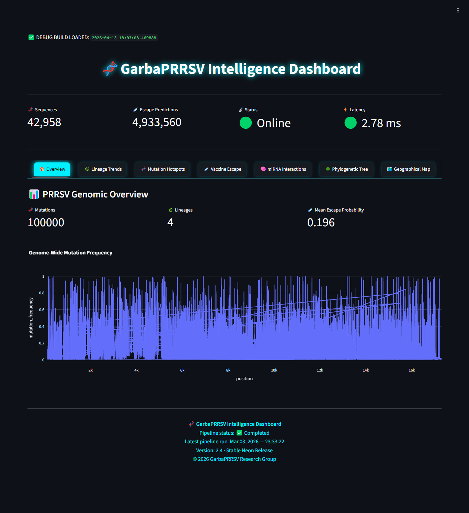
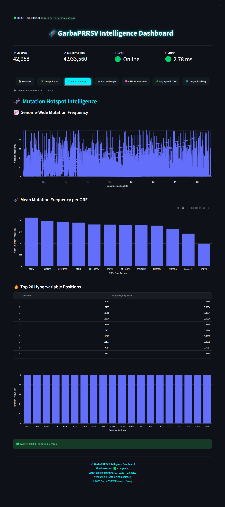
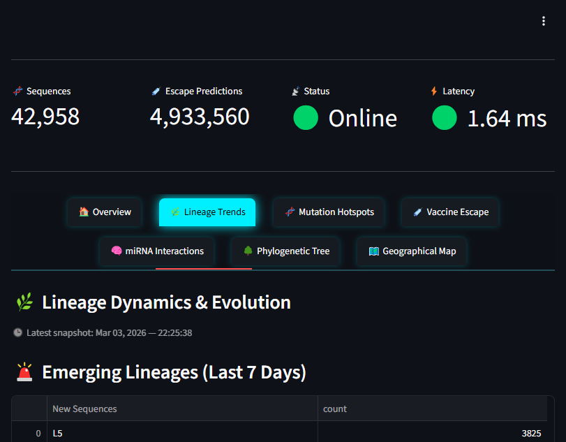
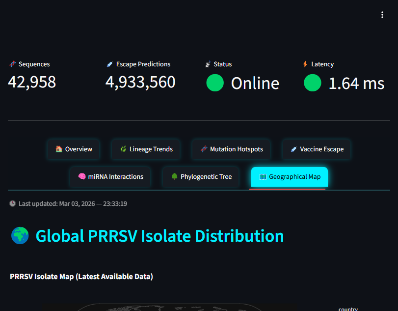

# 🧬 IntelliPRRSV2  
### Scalable Genomic Intelligence Platform for PRRSV Evolution, Mutation Analysis, and Vaccine Escape Prediction


---

## 📌 Overview

**IntelliPRRSV2** is a full-stack bioinformatics platform designed to transform large-scale PRRSV genomic data into actionable evolutionary and epidemiological intelligence.

The system integrates:

- Genome-wide mutation profiling  
- Phylogenetic reconstruction  
- Lineage classification  
- Vaccine escape prediction  
- miRNA–virus interaction modeling  
- Geographic surveillance  
- Interactive dashboard visualization  

---

## 🧠 Scientific Motivation

Porcine Reproductive and Respiratory Syndrome Virus (PRRSV) remains one of the most economically devastating viral pathogens in swine production worldwide.

Key challenges:

- High mutation rate (RNA virus)  
- Frequent recombination events  
- Rapid lineage turnover  
- Vaccine mismatch and immune escape  

Despite abundant genomic data, **integrated analytical systems remain limited**.

👉 **IntelliPRRSV2 bridges this gap by unifying multi-layer genomic intelligence into a single platform.**

---

## 🚀 Key Features

### 🔬 Genomic Intelligence
- Genome-wide mutation hotspot detection  
- ORF-level mutation quantification  
- Hypervariable locus identification  

### 🌳 Evolutionary Analysis
- MAFFT multiple sequence alignment  
- FastTree phylogenetic reconstruction (GTR model)  
- Lineage clustering (hierarchical + k-mer refinement)  

### 💉 Vaccine Escape Modeling
- Sequence identity scoring  
- Logistic transformation to escape probability  
- Risk classification (Low / Moderate / High)  

### 🧠 Host Interaction Modeling
- miRNA–PRRSV binding prediction  
- Complementarity scoring  
- Binding energy estimation  

### 🌍 Geographic Intelligence
- Country normalization  
- Latitude/longitude extraction  
- Global isolate distribution mapping  

### 📊 Interactive Dashboard
- Streamlit-based visualization  
- Multi-tab scientific interface  
- Pipeline-aware data filtering  

---

## 🏗️ System Architecture

```
FASTA Sequences
      ↓
Cleaning & Filtering
      ↓
Multiple Sequence Alignment (MAFFT)
      ↓
Mutation Hotspot Analysis
      ↓
Phylogenetic Tree (FastTree)
      ↓
Lineage Assignment
      ↓
Vaccine Escape Prediction
      ↓
miRNA Interaction Analysis
      ↓
Geographic Metadata Extraction
      ↓
📊 Streamlit Dashboard
```

---

## 📊 Dataset Summary

| Component | Scale |
|----------|------|
| Total sequences | 42,958 |
| Cleaned genomes | 1,866 |
| Full genomes (≥14.5 kb) | 1,627 |
| Mutation hotspot records | 27,164 |
| Vaccine escape predictions | 4.8M |
| Geo metadata records | 1,953 |

---

## 🧬 Mutation Analysis Framework

Mutation frequency is defined as:

```
Mutation Frequency = 1 − (matches to reference / total sequences)
```

This enables:

- Quantification of evolutionary divergence  
- Detection of hypervariable genomic regions  
- ORF-level mutation pressure analysis  

---

## Dashboard Preview

### Overview


### Mutation Hotspots


### Lineage Trends


### Geographic Distribution


---

## ⚙️ Installation

```bash
git clone https://github.com/agarba360-beep/intelliprrsv2.git
cd intelliprrsv2

python3 -m venv venv
source venv/bin/activate

pip install -r requirements.txt
```

---

## ▶️ Usage

### Run Full Pipeline

```bash
bash run_pipeline.sh
```

### Launch Dashboard

```bash
streamlit run dashboard/app.py
```

---

## 🔐 Environment Configuration

Create a `.env` file:

```
DB_HOST=localhost
DB_USER=prrsvuser
DB_PASSWORD=your_password
DB_NAME=intelliprrsv2_db
```

---

## 📦 Technologies

- Python 3.12  
- MySQL  
- MAFFT  
- FastTree  
- Biopython  
- Pandas / NumPy  
- Streamlit  
- Plotly  

---

## ⚠️ Limitations

- Mutation analysis is reference-dependent  
- No codon-level (synonymous/nonsynonymous) modeling yet  
- Aggregate mutation representation (not per-sequence)  
- Vaccine escape model uses partial sequence comparison  

---

## 🔮 Future Directions

- Codon-level mutation classification  
- Selection pressure analysis (dN/dS)  
- Real-time streaming pipeline  
- REST API deployment  
- Integration with surveillance systems  

---

## 📚 Citation (Coming Soon)

If you use IntelliPRRSV2 in your research, please cite:

```
Garba A. (2026). IntelliPRRSV2: A Scalable Genomic Intelligence Platform for PRRSV Evolution and Vaccine Escape Modeling.
```

---

## 👨‍🔬 Author

**Abubakar Garba**  
PRRSV Genomic Intelligence Research  

---

## 📜 License

MIT License

---

## ⭐ Project Status

✅ Active development  
✅ Production-ready pipeline  
✅ Research presentation ready (March 2026)  

---

## 🤝 Contributions

Contributions, issues, and feature requests are welcome.

---

## 🌟 Acknowledgment

This project represents a large-scale computational effort toward advancing PRRSV genomic surveillance, evolutionary analysis, and vaccine strategy support.
